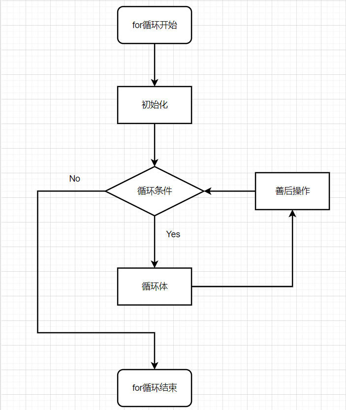
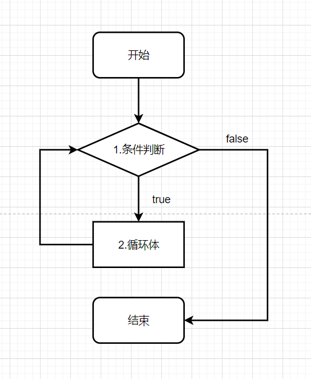

# 分支判断
1. C语言中所有的0值视为<u>**false**</u>,所有的非0值视为<u>**true**</u>.
2. C++中真为<u>**true**</u>,假为<u>**false**</u>.
3. 阅读程序题
   1. 请写出运行结果
```C++
    # include <iostream>

    using namespace std;

    int main(){
        
        int a = 1;
        if(a == 1) {
            cout << "a=1" << endl;
        }

        return 0;
    }
```

**运行结果:** a = 1

   2. 请写出运行结果
   
```C++
    # include <iostream>

    using namespace std;

    int main(){

        int a = 2;
        if(a == 1) {
            cout << "a = 1" << endl;
        } else {
            cout << "a != 1" << endl;
        }

        return 0;
    }
```

**运行结果:** a != 1  

   3. 请写出运行结果

```C++
    # include <iostream>

    using namespace std;

    int main(){
        
        int a = 3;
        
        if(a==1) {
            cout << "a = 1" << endl;
        } else if (a == 2) {
            cout << "a = 2" << endl;
        }else if (a == 3) {
            cout << "a = 3" << endl;
        }

        return 0;
    }
```

**运行结果:** a = 3

   4. 当输入19，2，21时下列程序运行的结果是

```C++
    # include <stdio.h>

    int main() {
        int a, b, c, max;
        printf("please scan three number a, b, c:\n");
        scanf("%d,%d,%d", &a, &b, &c);
        max = a;
        if(max < b) { max = b; }
        if(max < c) { max = c; }
        printf("max is:%d", max);
    }

```

**运行结果:**  max is 21

4. 编写代码，从键盘输入任意年份的整数N，通过程序运行判断该年份是否为闰年。判断任意年份是否为闰年，需要满足以下条件中的任意一个：
   1. 该年份能被4整除同时不能被100整除；
   2. 该年份能被400整除
```C++
    /*
  
    编写代码，从键盘输入任意年份的整数N，通过程序运行判断该年份是否为闰年。
    判断任意年份是否为闰年，需要满足以下条件中的任意一个：
    1. 该年份能被4整除同时不能被100整除；
    2. 该年份能被400整除

    */
    # include <iostream>

    using namespace std; 

    int main(){
        
        int year;

        cout << "请输入年份:" << endl; 
        cin >> year;
        
        if((year % 4 == 0 && year % 100 != 0) || (year % 400 == 0)){
            cout << "是闰年" << endl; 
        }else{
            cout << "不是闰年" << endl;
        }
        
        
        return 0;
    } 
```

# 循环
1. break语句功能是<u>**结束当前循环**</u>
2. coutine语句的功能是<u>**结束当前循环体**</u>
3. 画出for循环执行流程图。

4. 画出while循环执行流程图。

5. 写出下面代码运行结果
   1. 写出代码运行结果
```C++
    # include <iostream>

    using namespace std;

    int main(){
        
        for(int i = 0; i < 3; i++){
            for(int j = 1; j < 3; j++){
                cout << "i = " << i << ", j = " << j << endl;
                if(i == j){
                    break;
                }
            }  
        }

        return 0;
    }
```

**运行结果:**  
i = 0, j = 1  
i = 0, j = 2   
i = 1, j = 1  
i = 2, j = 1  
i = 2, j = 2  


   2. 写出代码运行结果
```C++
    # include  <iostream>

    using namespace std;

    int main(){

        int i = 10;
        
        while (--i >= 0){
            if(i % 2 == 0){
                continue;
            }

            cout << i << "\t"; 
        }

        return 0;
    }
```

**运行结果:**
9 7 5 3 1

6. 编写代码，求100-499之间所有水仙花数，即各位数字的立方和恰好等于该数本身的数。比如：153是水仙花数，满足1^3 + 5^3 + 3^3 = 153
```C++
    # include <iostream>

    using namespace std;

    int main(){
	
        int a, b, c;
        int sum;
        
        for (int i = 100; i <= 499; i++){
            sum = i;
            a = i % 10;
            b = i / 10 % 10;
            c = i / 100;
            
            if(sum == a * a * a + b * b * b + c * c * c){
                cout << sum << "是水仙花数,满足" << c << "^3 + " << b << "^3 + " << a << "^3 + " << "=" << sum << endl; 
            }
            
        }
        
        
        return 0;
    } 
```   

# 一维数组、二维数组
1. 一维数组是**一连串类型相同的数据的集合**
2. sizeof的作用**该类型在当前环境下所占字节数**
3. 二维数组是**一连串一维数组组成**
4. 数组定义为int a[6]={1,2,3,4,5,6},值为6的数组小标是(**B**)。
A.a[2] B.a[5] C.a[6] D.a[4]
5. 输入十个学生的成绩(double型),然后计算这十个学生分数的平均值，并输出.
```C++
// 输入十个学生的成绩，然后计算这十个学生分数的平均值，并输出
# include "iostream"

using namespace std;

int main(){
	
	double stuScore[10];
	double score;
	double sumScore;
	double averScore;
	
	cout << "请输入学生成绩" << endl;
	
	// 获取学生成绩 
	for(int i = 0; i < 10; i++){
		cin >> score;
		stuScore[i] = score;
	} 
	
//	计算全部成绩 
	for(int i = 0; i < 10; i++){
		sumScore += stuScore[i];
	}
	
//	计算平均成绩
	 averScore = sumScore / 10;
	 
	 cout << "平均成绩为:" << averScore << endl; 
	
	return 0;
}
```
6. 构造一个5行4列的二维数组，计算所有奇数行(从0开始)的元素的总和。
```C++
// 构造一个5行4列的二维数组，计算所有奇数行(从0开始)的元素的总和
# include <stdio.h>

int main(){
	
	int nums[5][4];  //5行4列的二维数组 
	int sum; // 存放总和 
	
	// 文字提示
	printf("请输入一个5行4列的二维数组\n"); 
	
	// 此部分用于获取二维数组的数据 
	// 外行 
	for(int i = 0; i < sizeof(nums)/sizeof(nums[1]); i++){
		// 内列
		for(int j = 0; j < sizeof(nums[i])/sizeof(int); j++){
			// 获取二维数组的数据 
			scanf("%d", &nums[i][j]);
		} 
	} 
	
	// 奇数行元素总和
	for(int i =0; i < sizeof(nums)/sizeof(nums[1]); i++){
		// 判断是不是奇数行 
		if (i % 2 != 0){
			for(int j = 0; j < sizeof(nums[i])/sizeof(int); j++){
					// 加入总和
					sum += nums[i][j];
			}
		} 
	} 
	
	// 输出结果
	printf("奇数行的总和为:%d", sum); 
	
	return 0;
}
```

# 指针、引用、取地址
1. 定义指针变量的方式是 * ，解引用的方式是 **类型*varName**。
2. 定义引用变量的方式是 & ，使用引用变量的方式是**类型&varName**。
3. int &a=b;修改a=5,则b= 5。
4. 若有定义:int x,*pb;则以下表示pb指向x的表达式是(**A**)。
A.pb=&x B.pb=x C.*pb=&x D.*pb=*x
5. 写出运行结果
```C++
#include <stdio.h>
int main(){
    int k=2, m=4, n=6;
    int *pk=&k, *pm=&m, *p, &a=n;
    // *pk 与 k 同地址
    // *pm 与 m 同地址
    // &a 与 n 共享内存
    *(p=&n)=*pk*(*pm);
    // p 与 n 同地址 也就是说 p现在存放的值为n的值6
    // k = 2 m = 4  也就是说 n的值现在 为 8
    printf("%d\n", n);
    // n 为 8 
    a = 7;
    printf("%d\n", n);
    // n 为 7
}
```
6. 代码实现题：在函数节、malloc节再出
